# LaunchCue

LaunchCue is a comprehensive platform for developer relations teams to manage clients, projects, tasks, and campaigns effectively.

## Features

- **Team Management**: Create and manage multiple teams for your organization
- **Client Management**: Organize client information and projects
- **Project Tracking**: Track project details, progress, and deadlines
- **Task Management**: Manage tasks with customizable statuses and priorities
- **Calendar**: Schedule events and view project deadlines
- **Brain Dump**: Use AI (Claude) to process and organize your thoughts and meeting notes
- **Resources**: Store and categorize important resources for your team
- **Notes**: Create, edit, and organize markdown notes

## Live Demo

Access the live application at [https://launchcue.netlify.app/](https://launchcue.netlify.app/)

## Screenshots and Features

### Dashboard


The Dashboard provides a comprehensive overview of your projects, tasks, and upcoming events. It's designed to give you a quick snapshot of your most important work items and priorities at a glance.

### Brain Dump - AI-Powered Note Processing
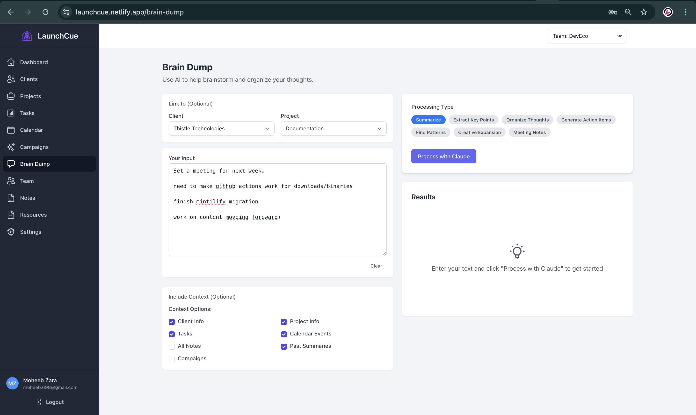

The Brain Dump feature leverages Claude AI to help you process unstructured notes and meeting information. Simply paste your notes, and Claude will help organize them.

#### Generate Actionable Items


Convert your notes into structured, actionable tasks with AI assistance. This feature extracts key action items from your notes and turns them into trackable tasks.

#### Summarize Content


Get concise summaries of lengthy notes or meeting transcripts to quickly capture the essential points.

#### Meeting Recap


Create structured meeting recaps from your notes, including key decisions, action items, and discussion points.

### Tasks Management
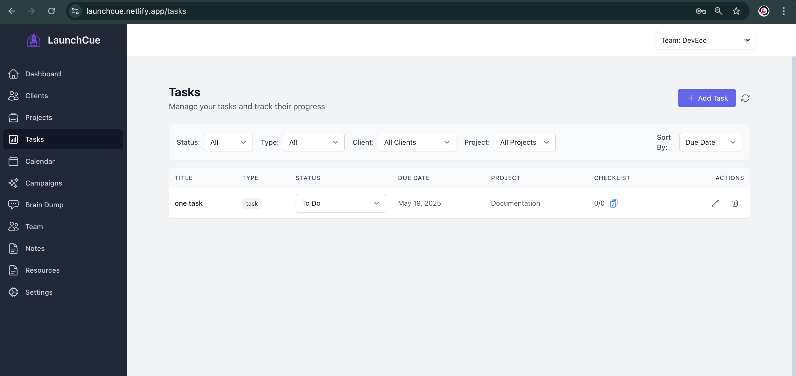

The Tasks view gives you a comprehensive list of all tasks across projects. Filter, sort, and manage your team's workload effectively.

#### Project Tasks
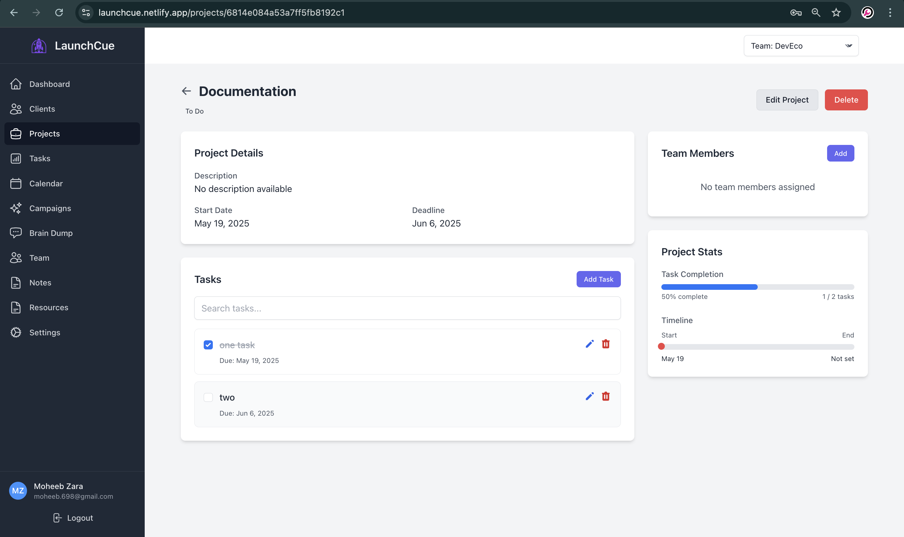

View and manage tasks specifically assigned to individual projects, helping you track progress on project-specific deliverables.

#### Task Checklists
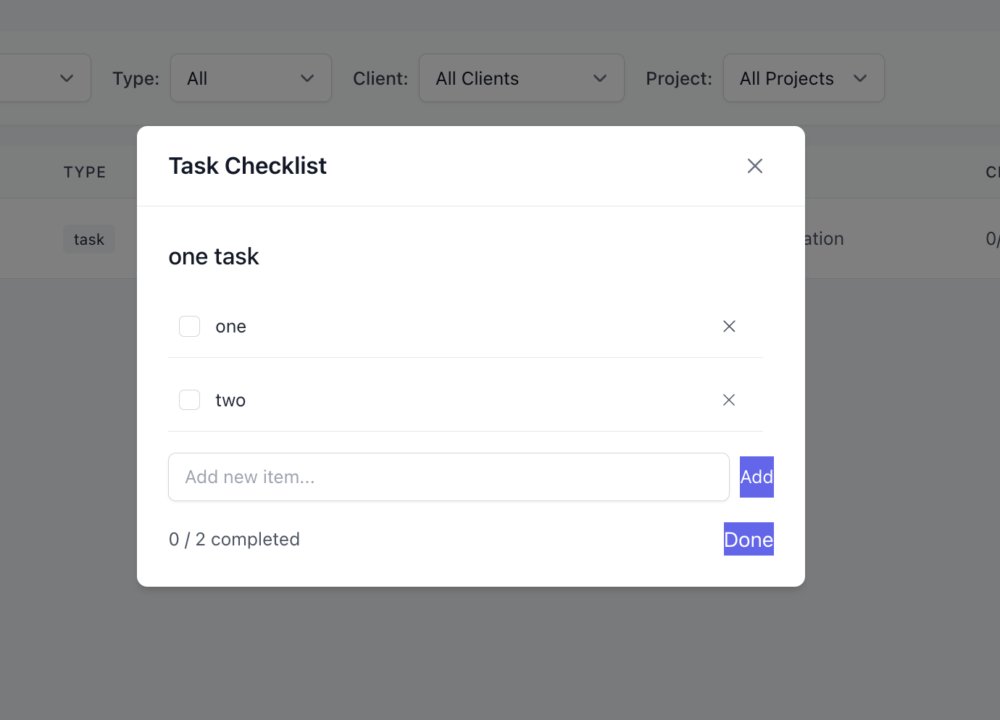

Break down complex tasks into manageable checklist items, making it easier to track progress on multi-step tasks.

### Client Management
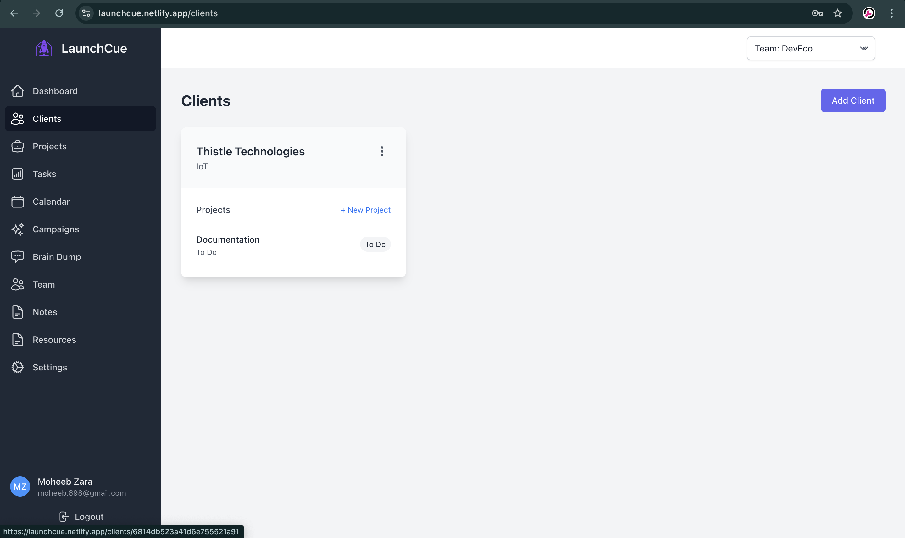

Manage all your clients in one place with a clean, organized interface. See key information at a glance and access client details easily.

#### Client Details
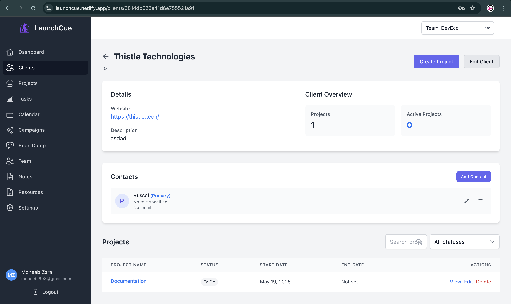

Access comprehensive client information, including contacts, projects, and communication history all in one view.

### Project Resources
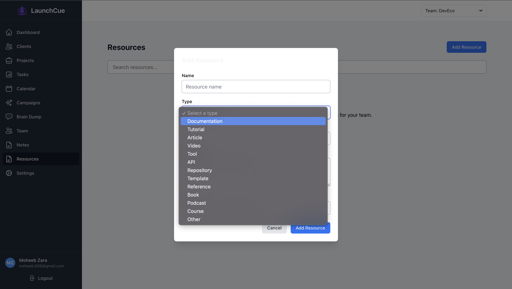

Store and organize important resources related to your projects, such as documents, links, and reference materials. Categorize resources for easy retrieval.

### Team Management


Manage team members, permissions, and roles to ensure everyone has the right level of access to relevant projects and information.

### Campaign Management


Plan and execute marketing campaigns with structured workflows. Track campaign progress and measure results.

### Calendar
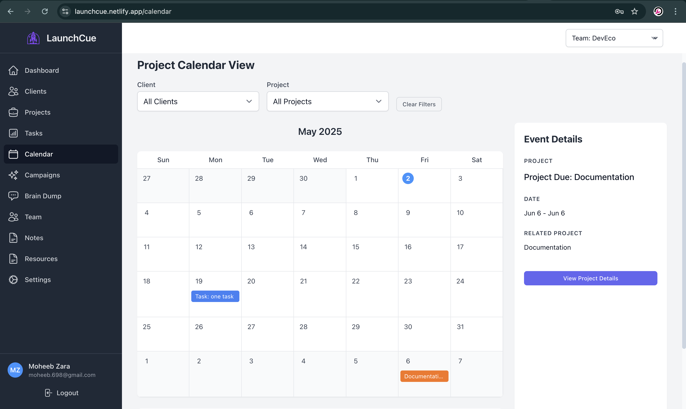

View all your project deadlines, meetings, and important dates in a unified calendar view. Schedule new events and manage your team's time effectively.

### Notes
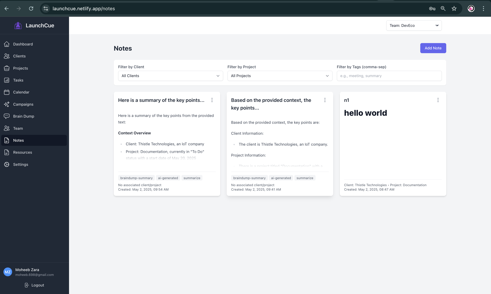

Create, organize, and share rich markdown notes related to your projects, clients, or general information. Tag notes for easy filtering and retrieval.

### User Profile
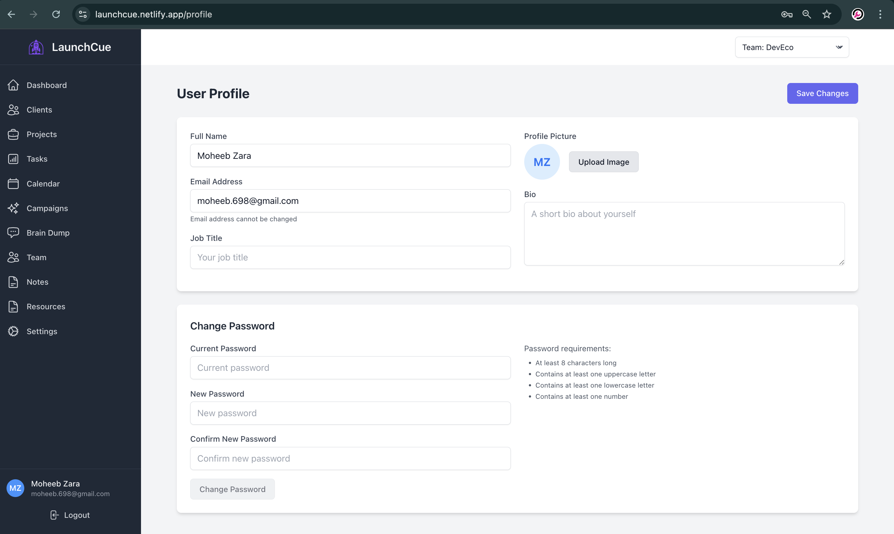

Manage your user profile, preferences, and personal settings to customize your LaunchCue experience.

### API Keys and Settings
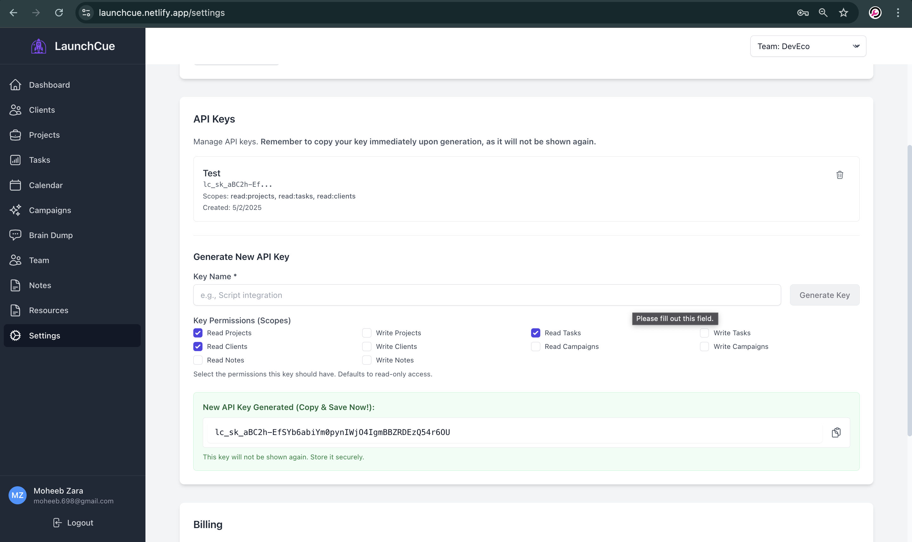

Generate and manage API keys for external integrations. Configure system-wide settings to customize LaunchCue for your team's needs.

## Tech Stack

- Vue 3 with Composition API
- Vite for development and building
- Tailwind CSS for styling
- MongoDB for data storage
- Netlify Functions for serverless backend API
- Vue Router for navigation
- Pinia for state management
- JWT for authentication
- Anthropic Claude API for AI processing

## Getting Started

### Prerequisites

- Node.js (v16 or later recommended)
- npm or yarn
- MongoDB Atlas account
- Anthropic API key for Claude integration
- Netlify CLI for local development

### Installation

1. Clone the repository:
   ```
   git clone https://github.com/yourusername/launchcue.git
   cd launchcue
   ```

2. Install dependencies:
   ```
   npm install
   ```

3. Create a `.env` file in the root directory with the following variables:
   ```
   ANTHROPIC_API_KEY=your_claude_api_key
   VITE_MONGODB_URI=your_mongodb_connection_string
   JWT_SECRET=your_jwt_secret_for_tokens
   VITE_MONGODB_REALM_APPID=your_mongodb_realm_app_id
   VITE_MONGODB_DATABASE=launchcue
   VITE_APP_NAME=LaunchCue
   ```

4. Run the development server with Netlify Functions:
   ```
   npm run dev
   ```

5. Build for production:
   ```
   npm run build
   ```

6. Deploy to Netlify:
   ```
   netlify deploy --prod
   ```

### Setting up MongoDB

1. Create a MongoDB Atlas cluster
2. Create a database called `launchcue`
3. Configure network access and database users
4. Add your connection string to the `.env` file

## Project Structure

```
launchcue/
├── netlify/
│   └── functions/        # Serverless functions for backend API
│       ├── ai/           # Claude AI integration functions
│       ├── auth/         # Authentication functions
│       ├── tasks/        # Task management functions
│       └── brain-dump/   # Brain dump related functions
├── public/               # Static assets
├── src/
│   ├── assets/           # CSS and other assets
│   ├── components/       # Reusable Vue components
│   ├── layouts/          # Page layouts
│   ├── pages/            # Page components
│   ├── router/           # Vue Router configuration
│   ├── services/         # API services for communicating with backend
│   ├── stores/           # Pinia stores
│   ├── App.vue           # Root component
│   └── main.js           # Entry point
├── .env                  # Environment variables
├── index.html            # HTML template
├── vite.config.js        # Vite configuration
├── netlify.toml          # Netlify configuration
└── tailwind.config.js    # Tailwind CSS configuration
```

## Backend Architecture

LaunchCue uses a serverless architecture with Netlify Functions to handle backend logic:

1. **Authentication**: JWT-based auth system with login/register endpoints
2. **Data Access**: MongoDB integration for data storage and retrieval
3. **AI Processing**: Claude API integration for brain dump processing
4. **API Organization**: RESTful API endpoints organized by resource type

All API calls are routed through the `/api/*` path which maps to the Netlify Functions.

## Frontend Architecture

The frontend uses a service-based approach:

1. **API Service**: Central service for handling HTTP requests to the backend
2. **Feature Services**: Domain-specific services that use the API service
3. **Stores**: Pinia stores for state management
4. **Components**: Reusable UI components

## License

This project is licensed under the MIT License - see the LICENSE file for details.

## Acknowledgements

- [Vue.js](https://vuejs.org/)
- [Tailwind CSS](https://tailwindcss.com/)
- [MongoDB](https://www.mongodb.com/)
- [Netlify Functions](https://www.netlify.com/products/functions/)
- [Anthropic Claude](https://www.anthropic.com/)

## API Usage

LaunchCue provides a RESTful API for external integrations.

### Authentication

API requests can be authenticated in two ways:

1.  **JWT Token (User Session):** For requests made from the LaunchCue frontend application after a user logs in. Handled automatically by the app.
2.  **API Key (External Integrations):** For requests made by external scripts or services. Generate an API Key in the application settings (Settings > API Keys).
    Include the key in the `Authorization` header:
    ```
    Authorization: Bearer YOUR_API_KEY_HERE
    ```
    Replace `YOUR_API_KEY_HERE` with your generated secret key (prefixed with `lc_sk_`).

**Note:** API Key authentication is scoped to the Team associated with the user who generated the key. You can also assign specific permission scopes to each API key for granular access control.

#### API Key Scopes

API keys use the following scope format:
- `read:resource` - Allows GET operations on the resource
- `write:resource` - Allows POST, PUT, DELETE operations on the resource
- `admin` - Grants full access to all resources
- `*` - Also grants full access

Examples:
- `read:tasks` - Can view tasks
- `write:projects` - Can create/edit/delete projects
- `read:clients` - Can view clients

When generating an API key, you can select which scopes it has access to. For security, always follow the principle of least privilege and only grant the minimum scopes needed.

### Endpoints

The API base URL depends on your deployment:
*   **Netlify Dev:** `http://localhost:8888/.netlify/functions`
*   **Production:** `https://launchcue.netlify.app/.netlify/functions`

#### Task Management

*   `GET /tasks` - List all tasks for the current team
    * **Query Parameters:** `projectId`, `status`, `type`
*   `GET /tasks/:taskId` - Get a specific task by ID
*   `POST /tasks` - Create a new task
*   `PUT /tasks/:taskId` - Update an existing task
*   `DELETE /tasks/:taskId` - Delete a task

#### Project Management

*   `GET /projects` - List all projects for the current team
    * **Query Parameters:** `clientId`
*   `GET /projects/:projectId` - Get a specific project by ID
*   `POST /projects` - Create a new project
*   `PUT /projects/:projectId` - Update an existing project
*   `DELETE /projects/:projectId` - Delete a project
*   `GET /project-detail/:projectId` - Get detailed project information including related tasks

#### Client Management

*   `GET /clients` - List all clients for the current team
*   `GET /clients/:clientId` - Get a specific client by ID
*   `POST /clients` - Create a new client
*   `PUT /clients/:clientId` - Update an existing client
*   `DELETE /clients/:clientId` - Delete a client
*   `GET /client-contacts/:clientId` - Get contacts for a specific client
*   `POST /client-contacts/:clientId` - Add a contact to a client
*   `PUT /client-contacts/:contactId` - Update a client contact
*   `DELETE /client-contacts/:contactId` - Delete a client contact

#### Campaign Management

*   `GET /campaigns` - List all campaigns for the current team
    * **Query Parameters:** `clientId`, `projectId`
*   `GET /campaigns/:campaignId` - Get a specific campaign by ID
*   `POST /campaigns` - Create a new campaign
*   `PUT /campaigns/:campaignId` - Update an existing campaign
*   `DELETE /campaigns/:campaignId` - Delete a campaign

#### Notes

*   `GET /notes` - List all notes for the current team
    * **Query Parameters:** `clientId`, `projectId`, `tag`
*   `GET /notes/:noteId` - Get a specific note by ID
*   `POST /notes` - Create a new note
*   `PUT /notes/:noteId` - Update an existing note
*   `DELETE /notes/:noteId` - Delete a note

#### Resources

*   `GET /resources` - List all resources for the current team
    * **Query Parameters:** `category`
*   `GET /resources/:resourceId` - Get a specific resource by ID
*   `POST /resources` - Create a new resource
*   `PUT /resources/:resourceId` - Update an existing resource
*   `DELETE /resources/:resourceId` - Delete a resource

#### Calendar Events

*   `GET /calendar-events` - List all calendar events for the current team
    * **Query Parameters:** `startDate`, `endDate`
*   `GET /calendar-events/:eventId` - Get a specific calendar event by ID
*   `POST /calendar-events` - Create a new calendar event
*   `PUT /calendar-events/:eventId` - Update an existing calendar event
*   `DELETE /calendar-events/:eventId` - Delete a calendar event

#### Brain Dump & AI Features

*   `POST /ai-process` - Process text using Claude AI
*   `GET /braindumps` - List all brain dumps for the current team
*   `POST /braindumps` - Create a new brain dump
*   `POST /brain-dump-create-items` - Generate actionable items from brain dump
*   `POST /brain-dump-context` - Get context for a brain dump

#### Team & User Management

*   `GET /teams` - List all teams available to the current user
*   `POST /teams` - Create a new team
*   `PUT /teams/:teamId` - Update an existing team
*   `DELETE /teams/:teamId` - Delete a team
*   `GET /users/profile` - Get the current user's profile
*   `POST /auth-login` - Login to the system
*   `POST /auth-register` - Register a new user
*   `POST /auth-logout` - Logout from the system
*   `POST /auth-change-password` - Change the current user's password
*   `POST /auth-switch-team` - Switch the active team

#### API Key Management

*   `GET /api-keys` - List all API keys for the current user
*   `POST /api-keys` - Generate a new API key
    * **Body:** `{ "name": "Key Name", "scopes": ["read:projects", "read:tasks"] }`
*   `DELETE /api-keys/:keyPrefix` - Delete an API key by its prefix

### Request and Response Format

All endpoints accept and return JSON data. For POST and PUT requests, send a JSON object in the request body. All responses include a JSON object with the requested data or an error message.

### Error Responses

The API uses standard HTTP status codes to indicate success or failure:

* `200 OK` - Request succeeded
* `201 Created` - Resource created successfully
* `400 Bad Request` - Invalid request parameters
* `401 Unauthorized` - Authentication required or failed
* `404 Not Found` - Resource not found
* `405 Method Not Allowed` - HTTP method not supported
* `500 Internal Server Error` - Server-side error

Error responses include a JSON object with an `error` property containing details about what went wrong.
