# LaunchCue

[](LICENSE)

**The command center for freelance & agency DevRel.** LaunchCue is a full-stack platform purpose-built for developer relations practitioners who juggle clients, projects, campaigns, content, and invoices, all in one place.

## Why LaunchCue?

Most project management tools are built for generic software teams. DevRel practitioners, especially freelancers and small agencies, need something that understands their workflow: client relationships, campaign tracking, scope management, invoicing, and AI-powered brain dumps for processing meeting notes into action items.

| | LaunchCue | Generic PM Tools | Spreadsheets |
|---|---|---|---|
| Client + Project hierarchy | Built-in | Workarounds | Manual |
| Scope & deliverables builder | Built-in | No | Manual |
| Invoice generation | Built-in | Add-on | Manual |
| AI brain dump processing | Claude-powered | No | No |
| Campaign tracking | Built-in | No | Manual |
| Keyboard-first workflow | `Cmd+K`, shortcuts | Varies | No |
| Self-hosted / own your data | Yes | No | Partial |

## Quick Start

```bash
# 1. Clone and install
git clone https://github.com/yourusername/launchcue.git
cd launchcue && npm install
cd server && npm install && cd ..

# 2. Configure environment
cp .env.example .env   # Fill in Supabase URL, keys, Anthropic API key

# 3. Start local Supabase + dev servers
npm run dev:full
```

**First steps after registering:**
1. Create your team (Settings → Team)
2. Add your first client
3. Create a project under that client
4. Add tasks to the project
5. Try Brain Dump -paste meeting notes and let Claude AI extract action items

## Features

### Core Workflow
- **Client Management** -Organize client info, contacts, and project history. Client health dashboard shows overdue/blocked status at a glance.
- **Project Tracking** -Track deliverables, deadlines, and progress per client. Status workflow from planning through completion.
- **Task Management** -Kanban board and list views. Assign tasks, set priorities, track with checklists. Keyboard shortcut `C` to create from anywhere.
- **Calendar** -Unified view of deadlines, meetings, and events. Recurring event support.

### DevRel-Specific
- **Campaign Management** -Plan and track developer campaigns with structured workflows and metrics.
- **Scope & Deliverables Builder** -Template-based scope documents. Draft → Sent → Approved workflow. Import scopes directly into invoices.
- **Invoice Builder** -Auto-incrementing invoice numbers, scope import, client billing. Outstanding invoice dashboard widget.
- **Brain Dump** -Paste unstructured meeting notes, and Claude AI extracts summaries, action items, and meeting recaps.
- **Resources** -Categorized link/document library for reference materials.
- **Notes** -Rich text notes with Tiptap editor, tagging, and organization.

### Platform
- **Global Search** -`Cmd+K` to search across everything. Type `>` for command palette (navigate, create, toggle dark mode).
- **Keyboard Shortcuts** -`G → D` dashboard, `G → T` tasks, `G → P` projects, `?` for help overlay.
- **Dark Mode** -Full dark theme with warm ink/charcoal palette.
- **Team Collaboration** -RBAC (owner/admin/member/viewer), team invitations, activity feed.
- **Client Portal** -Read-only portal for clients to view project status and onboarding.
- **Notifications** -Notification system with polling (60-second interval).
- **Getting Started Checklist** -Guided onboarding for new users.

## Screenshots

### Dashboard
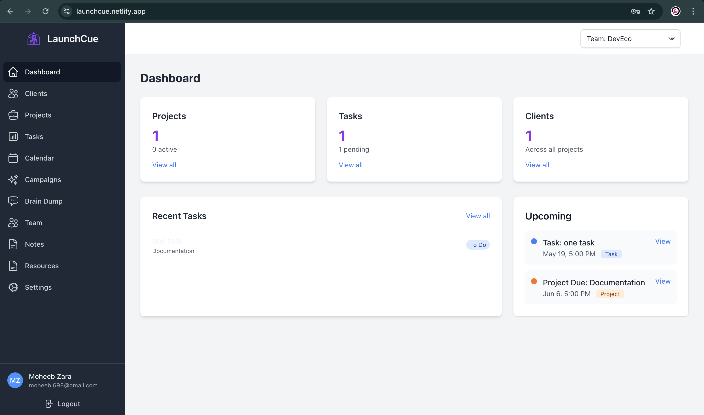

The Dashboard provides a comprehensive overview of your projects, tasks, and upcoming events with a getting started checklist for new users.

### Brain Dump - AI-Powered Note Processing
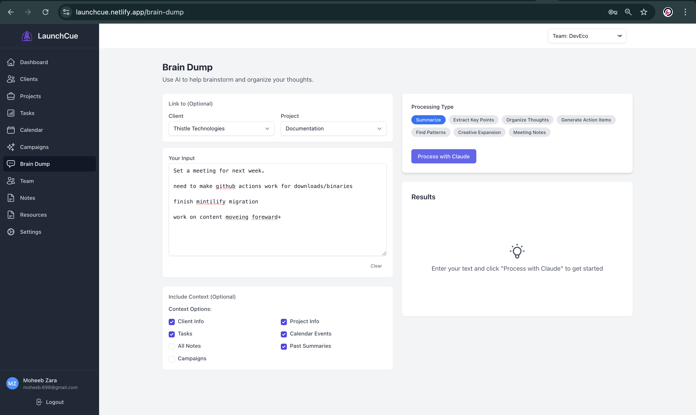

Paste unstructured meeting notes and let Claude AI process them into structured output.

#### Generate Actionable Items
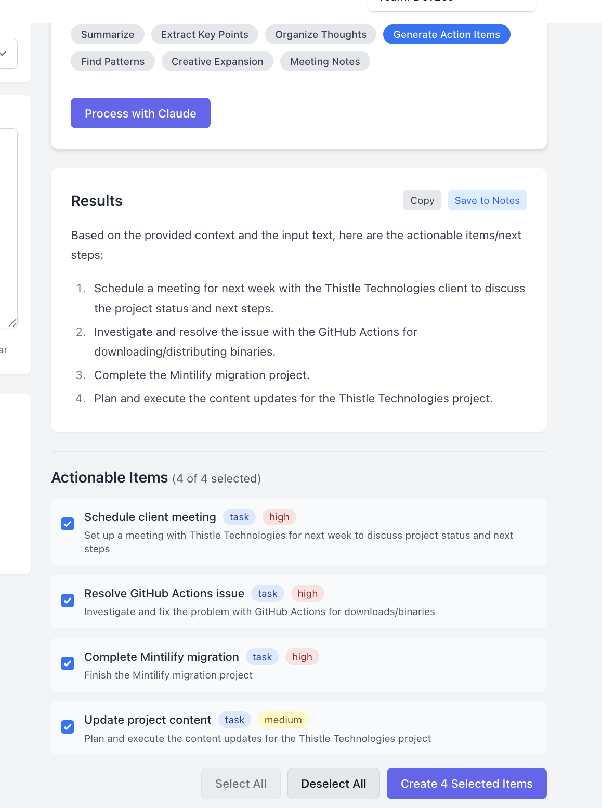

#### Summarize Content
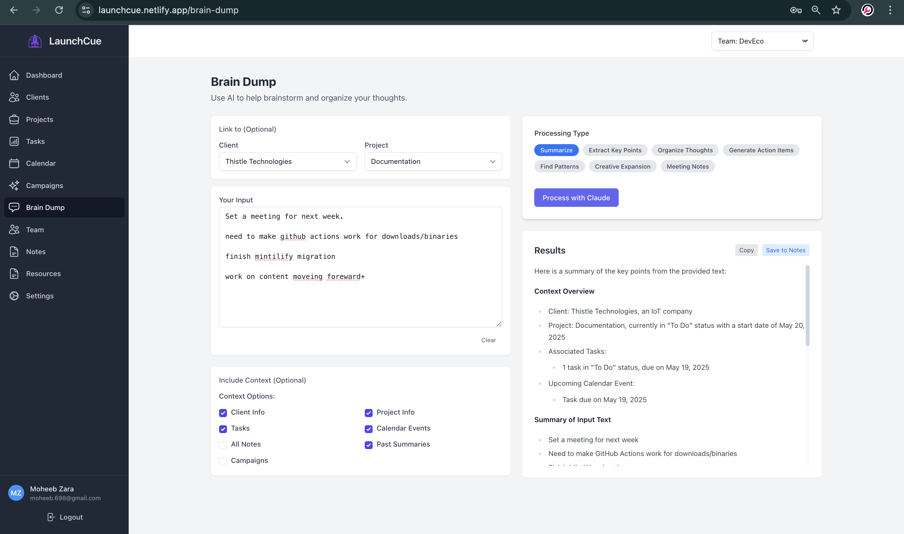

#### Meeting Recap
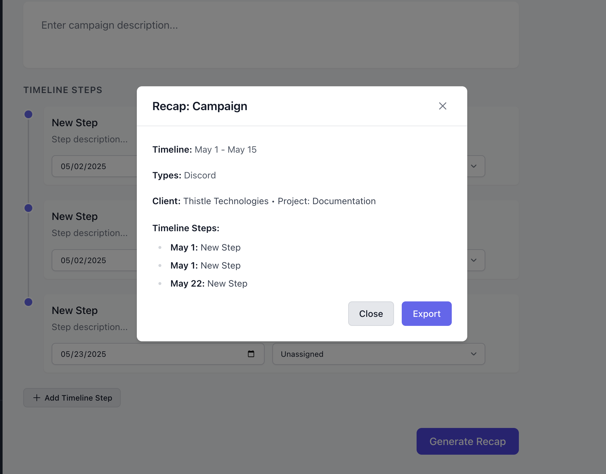

### Tasks Management
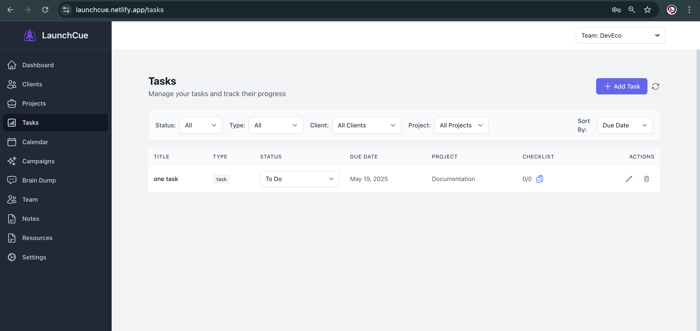

List and kanban views with filters, status, priority, and assignee tracking.

#### Project Tasks
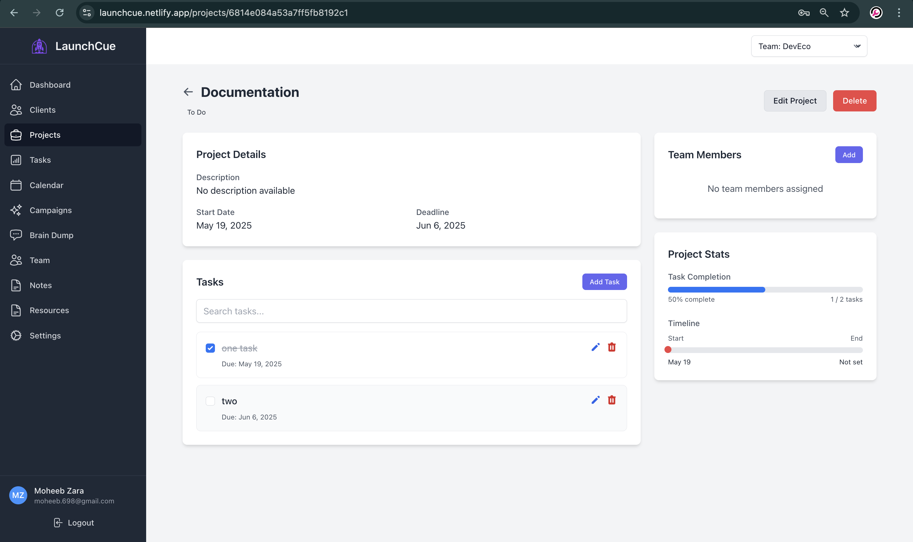

#### Task Checklists
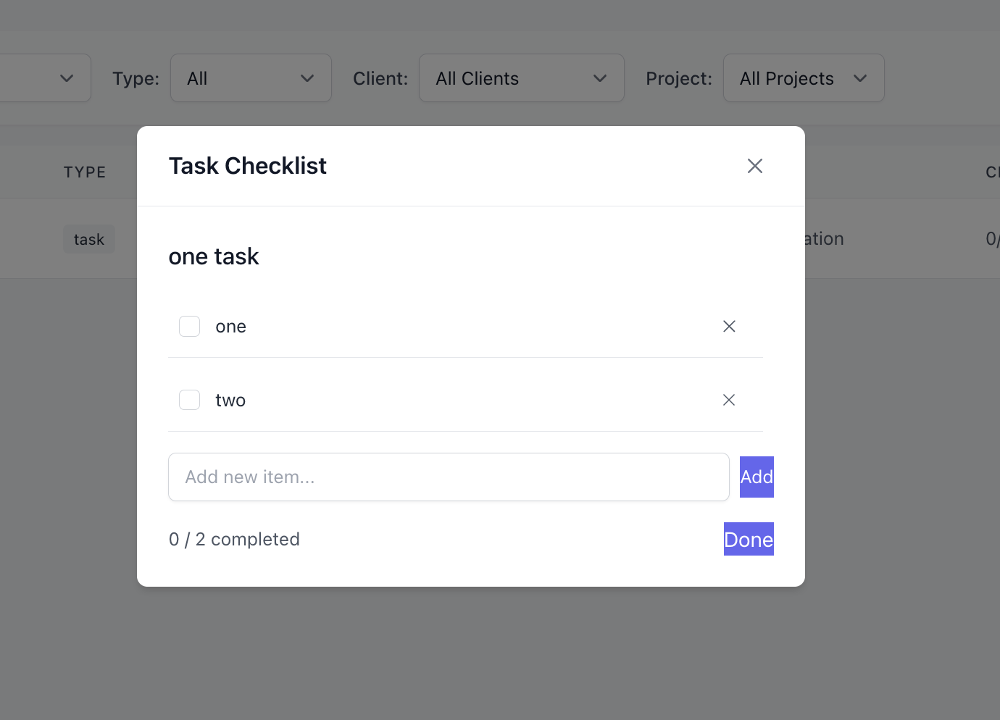

### Client Management
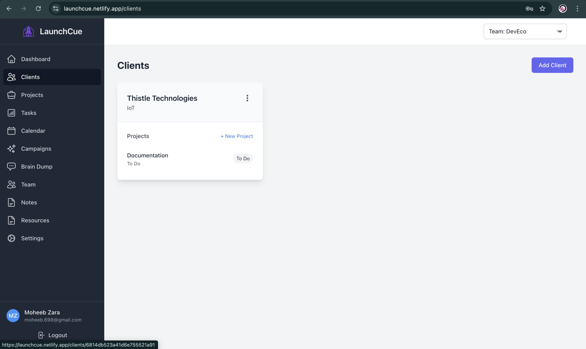

#### Client Details
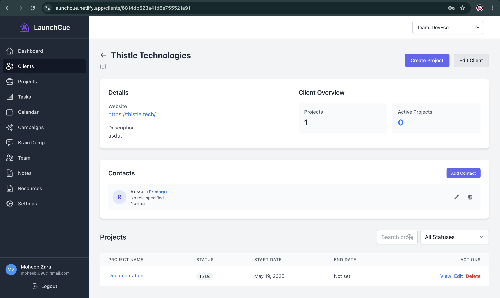

### Resources
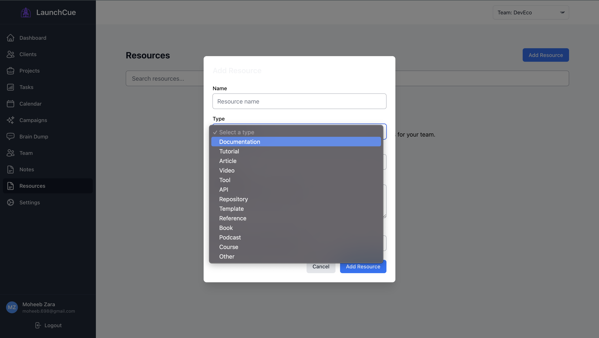

### Team Management


### Campaign Management
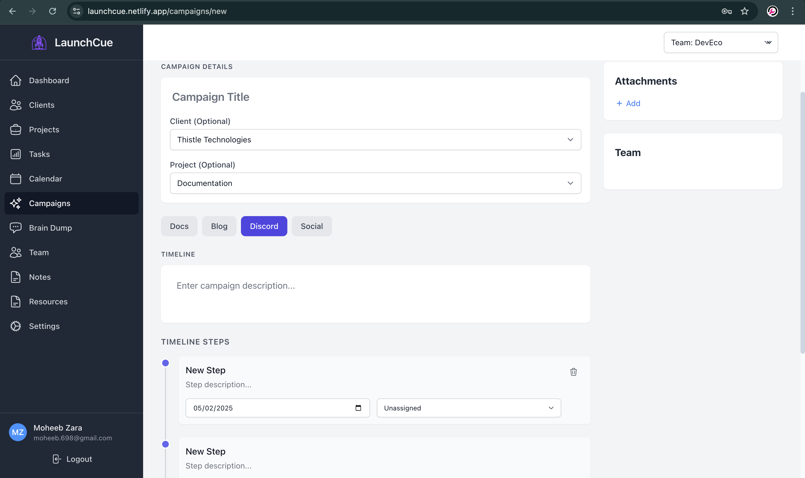

### Calendar
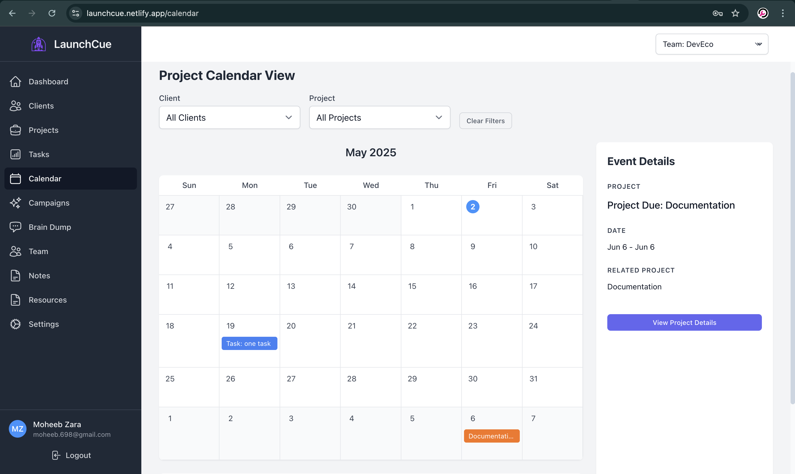

### Notes
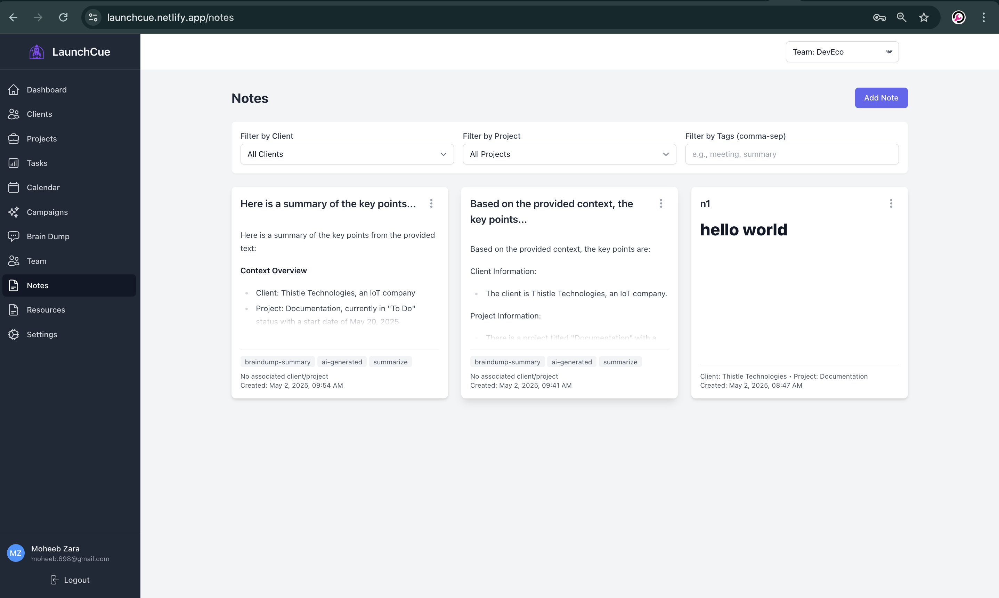

### User Profile
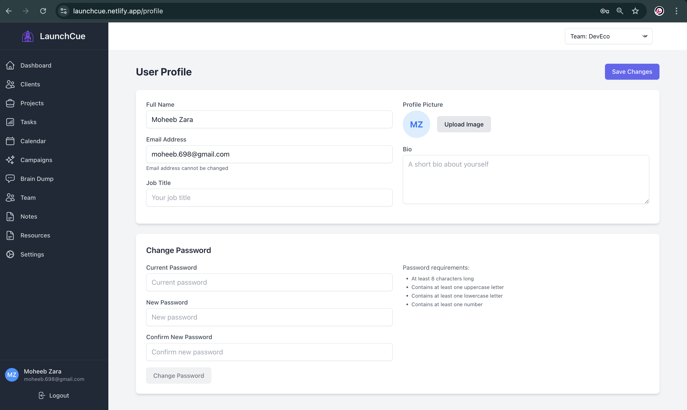

### Settings & API Keys
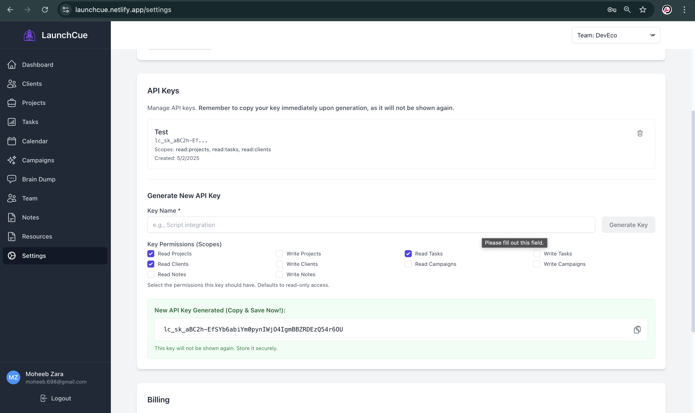

## Tech Stack

| Layer | Technology |
|-------|-----------|
| Frontend | Vue 3 (Composition API) + TypeScript |
| Styling | Tailwind CSS -brutalist design system |
| Build | Vite |
| State | Pinia (18 stores, repository pattern via DI) |
| Routing | Vue Router |
| Architecture | Plugin-based DI (ServiceContainer + PluginRegistry) |
| Database | PostgreSQL (via Supabase) |
| Auth | Supabase Auth (GoTrue) + RBAC |
| API | Supabase PostgREST (CRUD) + Express (AI, webhooks, email) |
| Notifications | Polling (60s interval via NOTIFICATION_REPO) |
| AI | Anthropic Claude API |
| Rich Text | Tiptap |
| Charts | Chart.js + vue-chartjs |
| Deploy | DigitalOcean App Platform + self-hosted Supabase |

## Design System

LaunchCue uses a **print-first brutalist** design language:

- `border-radius: 0` on all elements -cards, buttons, inputs, badges
- `border: 2px solid` as the structural backbone
- Hard offset shadows (no blur) -elements feel physical
- **Space Grotesk** for headings, **Inter** for body, **JetBrains Mono** for data
- ALL-CAPS overline labels for section headers and metadata
- Coral (`#E8503A`) + chartreuse (`#C8E840`) accent pair on warm parchment (`#FAF8F5`)
- Dark mode: warm ink (`#141210`) base with chalk borders

## Getting Started (Development)

### Prerequisites

- Node.js 18+
- npm
- Docker + Docker Compose (for local Supabase)
- Anthropic API key (for Brain Dump AI features)

### Installation

1. Clone the repository:
   ```bash
   git clone https://github.com/yourusername/launchcue.git
   cd launchcue
   ```

2. Install dependencies:
   ```bash
   npm install
   cd server && npm install && cd ..
   ```

3. Create a `.env` file from the example:
   ```bash
   cp .env.example .env
   ```
   Fill in your Supabase URL, anon key, service role key, and Anthropic API key.

4. Start local Supabase:
   ```bash
   npm run dev:supabase
   ```

5. Run all dev servers (Vite + Express + Supabase):
   ```bash
   npm run dev:full
   ```

6. Build for production:
   ```bash
   npm run build
   ```

## Project Structure

```
launchcue/
├── .do/                         # DigitalOcean App Platform config
├── infra/                       # Infrastructure (droplet-setup.sh)
├── server/                      # Express API server (AI, webhooks, email)
│   └── src/routes/              # ai.ts, webhooks.ts, email.ts
├── src/
│   ├── adapters/supabase/       # 25 Supabase adapter files (19 repos + 3 adapters + base + index + client)
│   ├── core/                    # ServiceContainer, EventBus, PluginRegistry
│   ├── modules/                 # 15 feature modules
│   ├── stores/                  # 18 Pinia stores (repository pattern)
│   ├── components/              # Vue components (ui/, dashboard/, etc.)
│   ├── composables/             # useKeyboardShortcuts, useModalState, etc.
│   ├── layouts/                 # DefaultLayout, AuthLayout, ClientLayout
│   ├── types/                   # TypeScript definitions
│   └── main.ts                  # App bootstrap + plugin registration
├── tests/                       # Vitest tests (52 across 4 files)
├── docker-compose.dev.yml       # Local Supabase stack
├── tailwind.config.js           # Brutalist design tokens
└── vite.config.ts               # Vite config + /api proxy
```

## Documentation

See the [docs/](docs/) folder for detailed guides:

- **[Architecture](docs/architecture.md)** -System design, plugin DI, Supabase backend
- **[Deployment](docs/deployment.md)** -DigitalOcean App Platform + Supabase Droplet
- **[API Reference](docs/api-reference.md)** -Supabase PostgREST + Express endpoints
- **[Database](docs/database.md)** -PostgreSQL schema, RLS policies
- **[Security](docs/security.md)** -Supabase Auth, RBAC, RLS, rate limiting
- **[Development](docs/development.md)** -Developer setup with Docker

## License

MIT -see [LICENSE](LICENSE) for details.

## Acknowledgements

- [Vue.js](https://vuejs.org/)
- [Tailwind CSS](https://tailwindcss.com/)
- [Supabase](https://supabase.com/)
- [Anthropic Claude](https://www.anthropic.com/)
- [Space Grotesk](https://fonts.google.com/specimen/Space+Grotesk)
- [JetBrains Mono](https://www.jetbrains.com/lp/mono/)
- [Tiptap](https://tiptap.dev/)
- [Chart.js](https://www.chartjs.org/)
- [DigitalOcean](https://www.digitalocean.com/)
